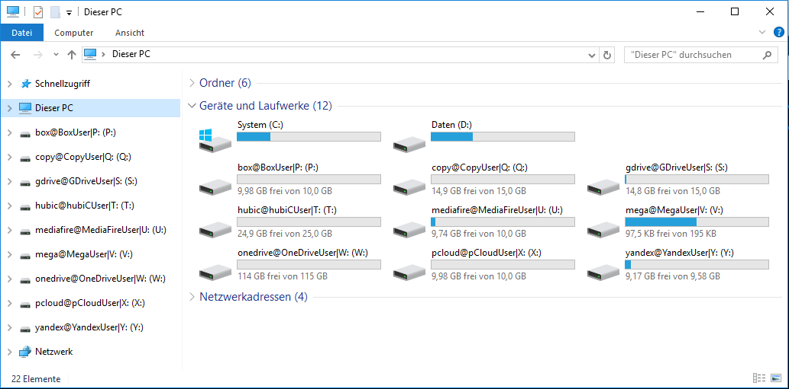

# DokanCloudFS
**DokanCloudFS** is a virtual filesystem for various publicly accessible cloud storage services on the Microsoft Windows platform.

[](https://github.com/viciousviper/CloudFS/blob/master/LICENSE.md)
[](https://github.com/viciousviper/CloudFS/releases)

| Branch  | Build status | Code coverage | Code analysis |
| :------ | :----------: | :-----------: | :-----------: |
| master  | [](https://ci.appveyor.com/project/viciousviper/dokancloudfs) | [](https://codecov.io/github/viciousviper/DokanCloudFS?branch=master)  | [](https://scan.coverity.com/projects/viciousviper-dokancloudfs) |
| develop | [](https://ci.appveyor.com/project/viciousviper/dokancloudfs) | [](https://codecov.io/github/viciousviper/DokanCloudFS?branch=develop) | |

## Objective

**DokanCloudFS** implements a virtual filesystem that allows direct mounting of various publicly accessible cloud storage services on the Microsoft Windows platform.

Mounted cloud storage drives appear as ordinary removable drives in Windows Explorer (albeit very slow ones) and can be used just about like any local drive or file share.



All content written through DokanCloudFS is transparently AES-encrypted with a user-specified key before handing it off to the cloud storage backend.

Some limitations apply concerning transfer speed, maximum file size, permissions, and alternate streams depending on parameters of the cloud storage service used as a backend.

## Features

- Mounting of cloud storage volumes as removable drives into Windows Explorer
  - number of mounted volumes only limited by available drive letters
  - mounting of multiple accounts of the same cloud storage service in parallel
  - automatic re-authentication to cloud storage services after first login (optional AES encryption of persisted account credentials and authentication tokens)
- Full support for interactive file manipulation in Winows Explorer including but not limited to
  - copying and moving of multiple files and folders between DokanCloudFS drives and other drives
  - opening of files in default application via Mouse double click
  - right-click-menu on drive, files, and folders with access to menu commands and drive/file properties
  - thumbnails display for media files
- Transparent client-side encryption and decryption of all file content via AESCrypt
  - encryption key configurable per drive
  - unencrypted files may be read and will be encrypted on modification

## Supported Cloud storage services

DokanCloudFS requires a gateway assembly for any cloud storage service to be used as a backend.

The expected gateway interface types and a set of prefabricated gateways are provided in a separate GitHub repository for the [CloudFS](https://github.com/viciousviper/CloudFS) project.<br />The associated NuGet packages [CloudFS](https://www.nuget.org/packages/CloudFS/) and [CloudFS-Signed](https://www.nuget.org/packages/CloudFS-Signed/) include preconfigured API keys for the included cloud storage services and are ready to use. Unless marked otherwise, CloudFS NuGet packages should be used in a version matching the DokanCloudFS version.

## System Requirements

- Platform
  - .NET 4.6
- Drivers
  - [Dokany](https://github.com/dokan-dev/dokany/releases) driver version 1.0.0 or greater installed
- Operating system
  - tested on Windows 8.1 x64 and Windows Server 2012 R2 (until version 1.0.0-alpha) /<br/>Windows 10 x64 (from version 1.0.1-alpha)
  - expected to run on Windows 7/8/8.1/10 and Windows Server 2008(R2)/2012(R2)

## Local compilation

### Using pre-configured API keys from the CloudFS NuGet packages

- Download and compile the *DokanCloudFS* solution using any of the following build configurations:
  - **Debug (NuGet)** / **Release (NuGet)** - non-optimized and optimized build, respectively, using gateway assemblies from the unsigned NuGet package
  - **Debug (NuGet-Signed)** / **Release (NuGet-Signed)** - non-optimized and optimized build, respectively, using gateway assemblies from the signed NuGet package
- During the build process, an appropriate *CloudFS* NuGet package will be downloaded and the assemblies and .config files required by *DokanCloudFS* will be copied to the *Library* directory.

### Using your own API keys

- Prepare the *CloudFS* solution
  - Download the [CloudFS](https://github.com/viciousviper/CloudFS) sources in a version matching the DokanCloudFS version
  - Retrieve your own cloud API authentication keys from the URLs cited in [Local Compilation](https://github.com/viciousviper/CloudFS#local-compilation) and apply them in the respective `Secrets.cs` files for the affected cloud services.
  - Compile the *CloudFS* solution
- Download and compile the *DokanCloudFS* solution using any of the following build configurations:
  - **Debug** - non-optimized build
  - **Release** - optimized build
- Copy all *IgorSoft.CloudFS.Gateways.\*.dll* assemblies and the associated *IgorSoft.CloudFS.Gateways.\*.dll.config* files from the *Gateways* directory  in the build output of *CloudFS.GatewayTests* to the *Library* directory of DokanCloudFS.

## Usage

- Configure the desired mount points in *DokanCloudFS.Mounter*'s configuration file *IgorSoft.DokanCloudFS.Mounter.exe.config*.<br/>See below for a sample configuration.
- Ensure the presence of all required cloud service gateway assemblies and their dependencies - either from a downloaded *CloudFS* NuGet Package or a local compile - in the path specified by the *libPath* attribute in the *&lt;mount&gt;*-tag in the config file (defaults to the solution's *.\Library* directory).
- Run *IgorSoft.DokanCloudFS.Mounter.exe* from the command line. Depending on your account configuration you *may* have to use an administrative command line. The following command line arguments are supported:
  ```
  IgorSoft.DokanCloudFS.Mounter 1.0.10

  Usage: Mounter [options] [command]

  Options:
    -?|-h|--help  Show help information

  Commands:
    mount
    reset

  Usage: Mounter mount [arguments] [options]

  Arguments:
    <userNames>  If specified, mount the drives associated with the specified users; otherwise, mount all configured drives.

  Options:
    -p|--passPhrase  The pass phrase used to encrypt persisted user credentials and access tokens
    -?|-h|--help     Show help information

  Usage: Mounter reset [arguments] [options]

  Arguments:
    <userNames>  If specified, purge the persisted settings of the drives associated with the specified users; otherwise, purge the persisted settings of all configured drives.

  Options:
    -?|-h|--help  Show help information
  ```
    - The **mount** command will mount the drives configured in *IgorSoft.DokanCloudFS.Mounter.exe.config*, optionally filtered by the specified user names.
      - If you use the **-p|--passPhrase** option for the first time, previously unencrypted persisted settings **of the drives mounted at this time** - and all newly acquired authentication credentials - will be encrypted with the specified pass phrase. Persisted settings of drives not mounted at this time will remain as they are.
    - The **reset** command will purge all persisted settings and require you to explicitely login on the next start of *IgorSoft.DokanCloudFS.Mounter.exe*.

### Sample configuration

```xml
  <mount libPath="..\..\..\Library" threads="5">
    <drives>
      <drive schema="box" userName="BoxUser" root="P:" encryptionKey="MyBoxSecret&amp;I" timeout="300" />
      <!--<drive schema="file" root="Q:" encryptionKey="MyFileSecret&amp;I" parameters="root=..\..\..\TestData" />-->
      <drive schema="gcs" userName="GoogleCloudStorageUser" root="R:" encryptionKey="MyGoogleCloudStorageSecret&amp;I" parameters="bucket=-- Insert bucket ID here --" timeout="300"
             apiKey="-- Insert Google Cloud Storage Credentials here --" />
      <drive schema="gdrive" userName="GDriveUser" root="S:" encryptionKey="MyGDriveSecret&amp;I" timeout="300" />
      <drive schema="hubic" userName="hubiCUser" root="T:" encryptionKey="MyhubiCSecret&amp;I" parameters="container=default" timeout="300" />
      <drive schema="mediafire" userName="MediaFireUser" root="U:" encryptionKey="MyMediaFireSecret&amp;I" timeout="300" />
      <drive schema="mega" userName="MegaUser" root="V:" encryptionKey="MyMegaSecret&amp;I" timeout="300" />
      <drive schema="onedrive" userName="OneDriveUser" root="W:" encryptionKey="MyOneDriveSecret&amp;I" timeout="300" />
      <drive schema="pcloud" userName="pCloudUser" root="X:" encryptionKey="MypCloudSecret&amp;I" timeout="300" />
      <drive schema="webdav" userName="webDavUser" root="Y:" parameters="baseAddress=https://webdav.magentacloud.de" encryptionKey="MyWebDavSecred&amp;I" timeout="300" />
      <drive schema="yandex" userName="YandexUser" root="Z:" encryptionKey="MyYandexSecret&amp;I" timeout="300" />
    </drives>
  </mount>
```

Configuration options:

  - Global
    - **libPath**: Path to search for gateway plugin assemblies (relative to the location of *IgorSoft.DokanCloudFS.Mounter.exe*).<br/>All plugin dependencies not covered directly by DokanCloudFS should be placed in this path as well.
    - **threads**: Number of concurrent threads used for each drive by the Dokan driver.<br />Defaults to 5.
  - Per drive
    - **schema**: Selects the cloud storage service gateway to be used.<br />Must correspond to one of the *CloudFS* gateways installed in the *libPath* subdirectory. Presently supports the following values:
      - *box*, *gcs*, *gdrive*, *hubic*, *mediafire*, *mega*, *onedrive*, *pcloud*, *yandex*
      - *file* (mounting of local folders only)
    - **userName**: User account to be displayed in the mounted drive label.
    - **root**: The drive letter to be used as mount point for the cloud drive.<br />Choose a free drive letter such as *L:*.
    - **apiKey**: Persistable credentials to be used for authentication with the cloud storage service in place of an interactive user login.
      - *gcs* gateway - The Google Cloud Service gateway presently requires that the Google credentials be specified in the API key configuration
    - **encryptionKey**: An arbitrary symmetric key for the transparent client-side AES encryption.<br />Leave this empty only if you *really* want to store content without encryption.
    - **parameters**: Custom parameters as required by the specific cloud storage service gateway. Multiple parameters are separated by a pipe-character `|`.
      - *file* gateway - requires a *root*-parameter specifying the target directory (e.g. `parameters="root=X:\Encrypted"`)
      - *gcs* gateway - requires a *bucket*-parameter specifying the Google Cloud Storage bucket to be mounted (e.g. `parameters="bucket=xczabc-12345-test-bucket"`)
      - *hubic* gateway - requires a *container*-parameter specifiying the desired target container (e.g. `parameters="container=default")`
      - *webdav* gateway - requires a *baseAddress*-parameter specifying the desired WebDAV hoster's access URL (e.g. `parameters="baseAddress=https://webdav.magentacloud.de"`)
      - other gateways - no custom parameters supported so far
    - **timeout:** The timeout value for file operations on this drive measured in seconds.<br />A value of *300* should suffice for all but the slowest connections.

> The Copy cloud storage service was retired after May 1<sup>st</sup> 2016 in response to this [announcement](https://www.copy.com/page/home;cs_login:login;;section:plans).

## Privacy advice

Certain privacy-sensitive information will be stored on your local filesystem by DokanCloudFS, specifically:

  - The file *%UserProfile%\AppData\Local\IgorSoft\IgorSoft.DokanCloudFS.&lt;RandomizedName&gt;\1.0.0.0\user.config* contains data required for automatic re-authentication with the configured cloud storage services such as
    - account names you entered in the browser or login window when authenticating to the various cloud storage services,
    - potentially long-lived authentication/refresh tokens, or in some cases **e-mail accounts and hashed login passwords** or even **user name and clear text password**, as provided by the specific cloud storage service for re-login.
  - The above information will be transparently **AES-encrypted** in the *.config* file if the command line option (**-p|--passPhrase**, see above in section [Usage](#Usage)) is used on *IgorSoft.DokanCloudFS.Mounter.exe*. Failing to specify a pass phrase will result in re-authentication data being stored in the clear.
  - The file *&lt;DokanCloudFS binary path&gt;\IgorSoft.DokanCloudFS.Mounter.exe.config* contains the symmetric AES encryption keys used for client-side encryption of cloud content.<br/>If you are concerned about protecting this information from unauthorized parties you should use appropriate tools to encrypt the files mentioned above at operating system level or possibly encrypt your system drive.

DokanCloudFS **does not** store your authentication password for any cloud storage service (which would be impossible in the first place for all services employing the OAuth authentication scheme).<br/>It **does**, however, store user name and password for WebDAV accounts because there is no separate authorization token concept in WebDAV.

## Limitations

  - DokanCloudFS only supports mounting of a cloud storage volume's root directory.
  - The maximum supported file size varies between different cloud storage services. Moreover, the precise limits are not always disclosed.<br />Exceeding the size limit in a file write operation will result in either a timout or a service error.
  - The files in a DokanCloudFS drive do not allow true random access, instead they are read or written sequentially as a whole.<br />Depending on the target application it *may* be possible to edit a file directly in the DokanCloudFS drive, otherwise it must be copied to a conventional drive for processing.
  - DokanCloudFS keeps an internal cache of directory metadata for increased performance. Changes made to the cloud storage volume outside of DokanCloudFS will not be automatically synchronized with this cache, therefore any form of concurrent write access may lead to unexpected results or errors.
  - The only encrypted file format supported by DokanCloudFS is the [AESCrypt](https://www.aescrypt.com/) file format.
  - DokanCloudFS distinguishes content encryption keys on a per-drive scale only. It is not possible to assign content encryption keys to specific subdirectories or to individual files.<br />Although you could, in theory, mount several copies of the same cloud service volume in parallel, these copies will not synchronize their cached directory structures in any way (see above).

## Known bugs

  - Several gateways
    - Writing of large (>> 10 Mb) files to cloud storage is unstable on the following platforms: *Box*, *pCloud*
  - *Mediafire* gateway
    - The Mediafire token management scheme depends on error-free operation when using long-term authentication tokens. Expect to re-authenticate via the login popup after network errors or if the DokanCloudFS process is aborted.

## Remarks

Due to the nature of the Dokan kernel-mode drivers involved, any severe errors inside DokanCloudFS can result in [Windows Blue Screens](https://en.wikipedia.org/wiki/Blue_Screen_of_Death).

**Don't install this project on production environments.**

You have been warned.

## Release Notes

| Date       | Version     | Comments                                                                       |
| :--------- | :---------- | :----------------------------------------------------------------------------- |
| 2016-10-02 | 1.0.10-beta | - Updated DokanNet to version 1.1.0.<br/>- Updated CloudFS to version 1.0.10-beta.<br/>- Fixed NuGet references. |
| 2016-08-31 | 1.0.9.1-alpha | - Fixed NuGet package references.                                                      |
| 2016-08-29 | 1.0.9-alpha | - Added reset command to Mounter.<br/>- Updated CloudFS to version 1.0.9-alpha<br/>- Fixed CloudFS NuGet reference.         |
| 2016-08-26 | 1.0.8-alpha | - Updated CloudFS to version 1.0.8-alpha<br/>- Support encryption of account credentials and access tokens in persistent settings.<br/>- Activated static code analysis via Coverity Scan.
| 2016-08-08 | 1.0.7-alpha | - Updated DokanNet to version 1.0.0-RC4<br/>- Successful authentication is required before mounting a cloud drive<br/>- Determine effective file size of encrypted files asynchronously to avoid timeouts when opening large directories in Windows Explorer |
| 2016-06-16 | 1.0.6-alpha | - Added separate build configurations for use with locally built CloudFS gateways or unsigned/signed CloudFS NuGet packages |
| 2016-05-19 | 1.0.5-alpha | - Updated DokanNet to version 1.0.0-RC3<br/>- Retired Copy gateway<br/>- Allow readonly-access to unencrypted files on otherwise encrypted cloud storage volumes<br/>- Support file creation for gateways that don't allow modification of existing files (e.g. Mega)<br/>- Fixed error in size calculation when retrieving encrypted files from cloud storage<br/>- Improved online file editing capability<br/>- Various bugfixes |
| 2016-04-18 | 1.0.4-alpha | - Updated DokanNet to version 1.0.0-RC2<br/>- Updated SharpAESCrypt to version 1.3.1<br/>- Fixed behavior for parallel mounting of several cloud drives.<br/>- New gateway sample configuration added for hubiC/Swift.<br/>- Various bugfixes |
| 2016-02-04 | 1.0.3-alpha | - Upgraded .NET framework version to 4.6.1<br/>- New gateway sample configurations added for MediaFire and Yandex Disk<br/>- Unit test coverage improved<br/>- Several bugfixes |
| 2016-01-24 | 1.0.2-alpha | - Gateway configuration extended to accept custom parameters. This change **breaks compatibility** with earlier API versions.<br/>- File Gateway configuration added in App.config |
| 2016-01-20 | 1.0.1-alpha | - NuGet dependencies updated, tests for CloudOperations made offline executable, code coverage analysis via codecov configured |
| 2016-01-10 | 1.0.0-alpha | - Initial release                                                              |
| 2015-12-30 | 1.0.0.0     | - Initial commit<br/>This version has not been extensively tested apart from the OneDrive gateway - **expect bugs**. |

## Future plans

- improve stability
- improve performance
- allow alternate encryption schemes
- allow mounting and unmounting of individual drives without restarting the mounter process

## References

DokanCloudFS would not have been possible without the expertise and great effort devoted by their respective creators to the following projects:

- **Dokany** - The User mode file system library for windows (see [Dokan](http://dokan-dev.github.io) for the entire Dokany ecosystem, [Dokany](https://github.com/dokan-dev/dokany) for the specific driver)
- **Dokan.NET** - The Dokan DotNET wrapper (see [Dokan.NET Binding](https://github.com/dokan-dev/dokan-dotnet))
- **SharpAESCrypt** - A C# implementation of the AESCrypt file format (see [SharpAESCrypt](https://github.com/kenkendk/sharpaescrypt))
- **Moq** - The most popular and friendly mocking framework for .NET (see [Moq](https://github.com/Moq/moq4))
- **SemanticTypes** - Support for implementing semantic types (see [SemanticTypes](https://github.com/mperdeck/semantictypes))
